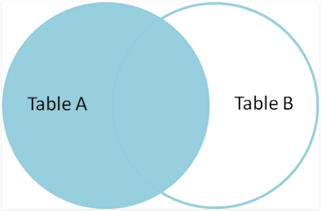
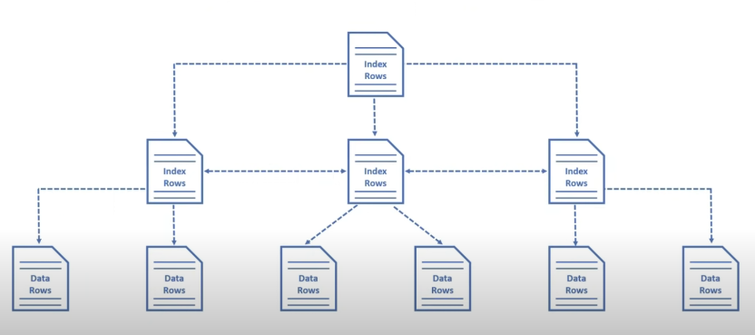
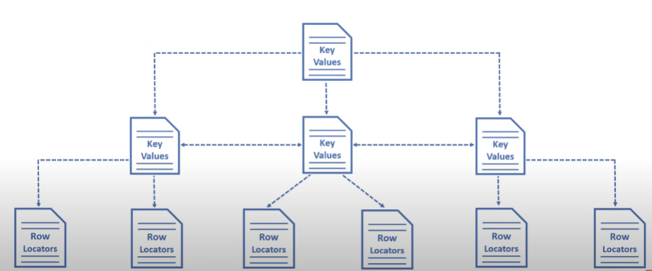
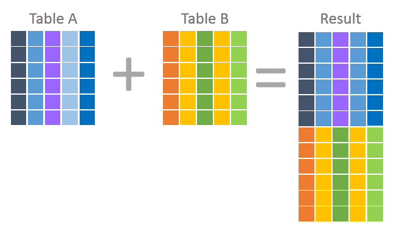

# RDBGuide
관계형 데이터베이스에 대한 공부

TODO : B+ tree 이어서 작성하기
## 정규화
  <details>
  <summary>
  제 1 정규화
  </summary>
  <br>

  * Atomic columns 
  * 한개의 컬럼에 1개의 값만 들어가야 한다.
  * 컬럼을 더 만들어 넣는다.
  </details>
  <br>

  <details>
  <summary>
  제 2 정규화
  </summary>
  <br>

  * No partial dependencies
  * 부분 종속성이 없어야 한다.
  * 테이블의 특정 부분들이 집합이 되어 PK에 의존하면 안된다.
  * 집합을 따로 테이블을 만들어 넣는다.
  </details>
  <br>

  <details>
  <summary>
  제 3 정규화
  </summary>
  <br>
  
  * No transitive dependencies
  * 이행 종속성이 없어야 한다.
  * 테이블의 특정 부분들이 내부 컬럼값에 의존하면 안된다.
  * 의존 부분들을 따로 테이블을 만들어 넣는다.
  </details>
  <br>

## Join
  <details>
  <summary>
  Inner Join
  </summary>
  <br>

  * 내부 조인은 조인되는 컬럼의 짝이 없을 경우 제외된다.
  * 소개팅과도 같다. 짝이 없으면? 나가리... 나는 인싸 조인이라고 부른다.
  * 
  * SELECT * FROM table_a JOIN table_b ON a.id = b.a_id;
  </details>
  <br>

  <details>
  <summary>
  Outer Join
  </summary>
  <br>
  
  * 외부 조인은 조인되는 컬럼의 짝이 없어도 모두 포함된다.
  * Join 되는 컬럼이 겹치지 않는다면 null 로 들어간다.   
       
  * SELECT * FROM table_a LEFT OUTER JOIN table_b ON a.id = b.a_id   
    UNION   
    SELECT * FROM table_a RIGHT OUTER JOIN table_b ON a.id = b.a_id;
  </details>
  <br>

  <details>
  <summary>
  Left / Right join
  </summary>
  <br>
  
     

  left / right join 은 해당 조인이 포함시킬 부분집합을 예기합니다.

  left join 의 경우 왼쪽의 모든 row 를 반환하고   
  match 가 존재하는 경우 해당 row 의 오른쪽 column 들을 같이 반환하고   
  left 에 존재하지만 match 가 없을 경우 오른쪽 column 에 null 을 반환합니다.   

  Left inner join 이라는 개념은 없습니다.   
  심지어 left outer join 이라는 개념은 이미 left join 안에 내포되어 있습니다.   

  위 그림의 Table A 안의 모든 부분들을 포함해야 한다는 조건 자체가 outer 의 개념에 해당되기 때문입니다. 
      
  </details>
  <br>
    
## [Indexing](https://www.youtube.com/watch?v=HubezKbFL7E)
  <details>
  <summary>
  Clustered index
  </summary>
  <br>

  테이블이 생성될 때 pk 를 기준으로 나열된 Balanced+ Tree 가 생깁니다.   
  이 B+ Tree 를 사용하는 index 가 Clustered index 이라고 합니다.   

     

  여기에서 leaf node 들은 모두 data Rows 라고 나오는데 이는 Data 의 정보를 I/O 할 위치정보를 담고 있습니다.   

     

  다음은 WHERE id = 1120 가 Clustered index B+ tree 를 타는 과정입니다.   

  </details>
  <br>  

  <details>
  <summary>
  Non-clustered index
  </summary>
  <br>
  
  PK 가 아닌 다른 컬럼에 인덱싱을 하신다면 이는 모두 Non-clustered index 에 해당됩니다.      
  이 인덱스의 동작 원리는 B+ tree 이며 해당 인덱스의 값을 바탕으로 정렬됩니다.   

     

  Row Locators 이라고 나온 값들은 실제 데이터의 PK 값을 저장하고 있습니다.   
  그래서 Non-clustered index 를 통과하고 그 이후에 Clustered index 를 통과하게 됩니다.   
  </details>
  <br>

  <details>
  <summary>
  B+ Tree
  </summary>
  <br>

  B+ Tree 는 leaf node 들이 doubly linked list 의 형태가 되어 있는 balanced tree 입니다.   
  RDB 는 이 B+ tree 를 통해 Clustered / Non-clustered index 를 만듭니다.   
  B Tree 의 설질을 갖고 있어 특정 노드가 해당 크기를 넘어설 경우 위로 보내고, 분산시키며 balance 를 유지시킵니다.
  </details>
  <br>

  <details>
  <summary>
  explain (튜닝)
  </summary>
  <br>
  
  [이분만큼 index 튜닝에 대하여 실질적으로 실험하며 보여준 동영상은 없었습니다.](https://www.youtube.com/watch?v=HubezKbFL7E&t=557s)    

  <br>
  
  EXPLAIN 구문을 사용하신다면 특정한 쿼리의 인덱싱을 벤치마킹할 수 있습니다.   

  ```sql
  EXPLAIN SELECT * FROM user WHERE id = 1
  ```

  결과   

  |구분|내용|
  |---|---|
  |id|SELECT 절마다 부여된 번호|
  |table|참조하는 테이블|
  |select_type|사용된 SELECT 절의 종류|
  |type|조회하는 전략, 방법|
  |possible_keys|조회에 사용이 가능한 인덱스 리스트
  |key|실제로 사용되는 인덱스|
  |key_len|실제로 사용되는 인덱스의 길이|
  |ref|실제로 사용되는 인덱스 이전의 선행 테이블의 컬럼|
  |rows|읽기 위해 통과되는 row 의 개수|
  |extra|추가정보| 

  type

  |구분|내용|
  |---|---|
  |const|단일한 테이블에서 최대 1개의 단일한 결과가 나올 경우|
  |eq_ref|join 된 테이블에서 최대 1개의 단일한 결과가 나올 경우|
  |ref/range|range 의 시작 점을 찾고 linked-list 를 진행하며 range 가 끝나는 부분을 찾는 경우|
  |index|인덱스를 사용하여 제일 첫 leaf node 에서 linked-list 진행하며 찾을 때까지 나가는 경우|
  |all|full table scan 으로 모든 컬럼을 받아 찾는 경우|

  이 결과에서 유심하게 보셔야 할 부분은 `type`, `possible_keys`, `key`, `rows` 입니다.

  `type` 에서   
  type `const`, `eq_ref` 의 경우 더 빨라질 여지는 없습니다.   
  단일한 값을 찾는 인덱스를 사용하였기 때문입니다.   
  
  `ref`/`range` 가 나왔을 경우 쿼리에서 BETWEEN 구문같은 범위를 지정했을 경우 의도한
  대로 인덱싱이 진행되었습니다.

  `index`/`all` 이 나왔을 경우 index tree 나 table 을 전수조사하였다는 의미임으로
  개선의 여지가 있습니다.   

  `possible_keys`의 경우   
  인덱스를 사용할 수 있지만 어떠한 이유로 인덱스를 사용하지 않는 것이 더 빠르다고
  mysql 이 인식할 수 있습니다.   
  예로 DISK I/O 가 개별적으로 이뤄지기보다 batch 단위로 이뤄지는 것이 더 좋다고 판단되는 경우 
  인덱스가 사용되지 않고 possible_keys 에 위치할 수 있습니다.   

  `key` 를 통해서 자신의 인덱스가 실제로 사용되는지 확인하시면 됩니다.   

  `row` 를 통해 어느정도의 row 를 통과해야 하는지 인덱스의 성능을 확인할 수 있습니다.
  </details>
  <br>

## Transaction
  <details>
  <summary>
  업무단위 / 실행단위
  </summary>
  <br>
  
  `Transaction` 의 뜻은 원래 `은행에서의 송금`을 뜻합니다.   

  이 은행에서 sql 을 사용한다면 송금의 과정이 중간에 중단되거나, 개입이 있어서는 안됩니다.   

  Transaction 은 위 의미를 그대로 함구합니다.

  sql 명령어 중간에 중단, 개입을 막아주는 역확을 합니다.   

  golang 의 mutex 나 java 의 lock 과 같다고 생각하면 됩니다.
  <br>
  
  ### 업무단위
  업무단위란 말 그대로 `일이 이뤄지는 단위`를 뜻합니다.   
  위의 예시를 생각하면 `송금` 으로 이해하실 수 있습니다.

  ### 실행단위
  실행단위란 `한 업무가 완성되기까지 실행되는 모든 단위`들을 뜻합니다.   
  위의 예시를 생각하면 user A 가 B 에게 10000원을 송금할 때   
  A 에서 10000원-- 한다.   
  B 에서 10000원++ 한다.   
  송금 업무단위에 해당하는 실행 단위 2개가 되겠습니다.
  </details>
  <br>

  <details>
  <summary>
  commit / rollback
  </summary>
  <br>
  2개의 실행단위가 있다고 하겠습니다.   

  ```sql
  UPDATE 유저 SET cash = cash - 10000 WHERE name = 김도형;
  ```
  ```sql
  UPDATE 유저 SET cash = cash + 10000 WHERE name = 김민형;
  ```

  위 실행단위는 중간에 중단되거나 개입이 있어서는 안됩니다.   
  이를 위해 2개의 명령어를 작성한 이후 `COMMIT` 이라는 명령어를 작성합니다.
  ```sql
  UPDATE 유저 SET cash = cash - 10000 WHERE name = 김도형;
  UPDATE 유저 SET cash = cash + 10000 WHERE name = 김민형;
  COMMIT;
  ```

  이 경우 `COMMIT` 안정된 송금을 확정짓습니다.   
  만일 송금이 실패하면 2개의 실행단위가 다 실패하고   
  송금이 성공하면 김도형과 김민형의 돈은 정확하게 이동합니다.   
  
  만약 위의 commit 을 취소하고 싶다면 `ROLLBACK` 을 사용하시면 됩니다.
  ```sql
  UPDATE 유저 SET cash = cash - 10000 WHERE name = 김도형;
  UPDATE 유저 SET cash = cash + 10000 WHERE name = 김민형;
  COMMIT;
  ROLLBACK;
  ```
  </details>
  <br>

## Operator
  <details>
  <summary>
  LIKE
  </summary>
  <br>
  
  SQL 만의 정규표현식으로 column 을 query 할 수 있는 기능   
  <br>

  ```sql
  SELECT * FROM users
  WHERE name LIKE '김%';
  ```

  다음 구문은 '김' 씨로 시작하는 user 를 찾는 구문입니다.   
  
  이렇게 `LIKE` 는 특정 column 에 regex 를 할 수 있습니다.   
  정확히 regex 는 아니지만 쓰임이 비슷하며 SQL 만의 규칙을 따릅니다.   
  <br>
  
  
  |구문|의미|
  |:---:|:---:|
  |%|0 개, 1개 또는 여러개의 char|
  |_|1 개의 char|
  |[ABC]|A 또는 B 또는 C char 1개|
  |[^A]|A 가 아닌 char 1개|
  |[0-9]|0 에서 9 까지의 숫자 char 1개|
  |[a-z]|a 에서 z 까지의 숫자 char 1개|
  |[A-Z]|A 에서 Z 까지의 숫자 char 1개|

  예시   
  `_도_` -> 김도형, 장도현   
  `%라면` -> 차슈라면, 너구리라면   
  `[빨주노]%` -> 빨강색, 주황색, 노랑색   

  그 외   
  `NOT` 을 붙여서 전체적인 LIKE 구문의 역을 구할 수도 있습니다.   
  Regex 에 비하여 구현력이 많이 떨어집니다.   
  그래서 Mysql 을 사용하신다면 REGEXP를 사용하시는 것을 추천드립니다.
  </details>
  <br>

  <details>
  <summary>
  GROUP BY
  </summary>
  <br>

  특정한 컬럼으로 중복되는 값들을 모으는 방식입니다.   
  주로 집계함수를 쓰고 싶을 때 사용됩니다.    

  |id|name|age|
  |:---:|:---:|:---:|
  |1|김도형|25|
  |2|김준형|23|
  |3|장광식|25|
  |4|권설민|24|
  <br>
  
  `SELECT COUNT(age) FROM TABLE GROUP BY age`

  |COUNT(age)|age|
  |:---:|:---:|
  |1|23|
  |1|24|
  |2|25|
  <br>
  
  집계함수에는 `COUNT(), MAX(), MIN(), SUM(), AVG()` 가 있습니다.    

  <br>

  ### 특징    

  `SELECT * FROM TABLE GROUP BY age`

  |id|name|age|
  |:---:|:---:|:---:|
  |2|김준형|23|
  |4|권설민|24|
  |1|김도형|25|

  집계함수가 아닌 실제 컬럼이 SELECT 안에 들어갔을 때 GROUP BY 의 컬럼의 가장 첫 값들을 반환합니다.   
  age 가 25 인 row 중 김도형이 장광식보다 먼저 나와있어 김도형이 출력됩니다.   
  
  GROUP BY 는 정렬되어 출력됩니다.   
  23-24-25 순서대로 출력됩니다. 문자일 경우 Alphabetic order 로 출력됩니다.    
  <br>

  ### DISTINCT 와의 차이
  GROUP BY 와 DISTINCT 는 비슷하면서도 다릅니다.

  `SELECT DISTINCT column FROM table`   
  `SELECT column FROM table GROUP BY column`   

  위 두 구문의 정렬 순서만 빼면 결과는 같습니다.   
  하지만 그 의미상으로는 다른 예기를 하고 있습니다.    
  <br>

  DISTINCT 는 different 와 같은 의미로 `SELECT DISTINCT column FROM table` 를 풀어 설명하면   
  column 의 다른(different/DISTINCT) 한 값들을 찾아주라는 의미입니다.   
  
  GROUP BY 는 해당 컬럼으로 모와서 나타내라는 의미로 `SELECT column FROM table GROUP BY column` 는   
  column 이 같은 값들로 모와서(GROUP BY) 찾아주라는 의미입니다.   

  DISTINCT 는 단일한 값의 정보들만이 내포되어 있지만 GROUP BY 는 집합의 정보가 내포되어 있습니다.   
  그래서 DISTINCT 는 SELECT 이후에 쓰이고 GROUP BY 는 FROM 이후에 쓰입니다.   
  <br>
  
  그럼 퀴즈 ~~~   

  `SELECT COUNT(DISTINCT Country) FROM Customers`   
  `SELECT COUNT(Country) FROM Customers GROUP BY Country`

  이 경우 어떻게 의미가 다르며, 어떠한 결과가 나올까요?   

   <details>
   <summary>
   정답
   </summary>
   <br>

   [직접 확인](https://www.w3schools.com/sql/trysql.asp?filename=trysql_select_distinct2)

   `SELECT COUNT(DISTINCT Country) FROM Customers`   
   Country 가 다른(Distinct) 값들이 총 몇개 있습니까?   

   |COUNT(DISTINCT Country)|
   |:---|
   |21|

   `SELECT COUNT(Country) FROM Customers GROUP BY Country`   
   Country 로 모은 집합의(GROUP BY) 각각 요소들은 총 몇개 있습니까?   

   |COUNT(Country)|
   |:---|
   |3|
   |2|
   |2|
   |9|
   |3|
   |2|

   DISTINCT 는 단일한 값의 정보들만이 내포되어 있지만 GROUP BY 는 집합의 정보가 내포되어 있습니다.

   그래서 이러한 의미와 결과, 선언 위치의 차이가 있습니다.   
   </details>
   <br>
  </details>
  <br>

  <details>
  <summary>
  Aliases / AS
  </summary>
  <br>
  
  Aliases 는 컬럼 / 테이블을 위한 경우로 나뉩니다.   
  <br>
  
  컬럼을 위한 경우   
  ```sql
  SELECT column AS alias FROM table
  ```
  테이블/서브쿼리를 위한 경우 
  ```sql
  SELECT column FROM table AS alias
  ```
  <br>
  
  ### 컬럼을 위한 `alias`
  
  1. 컬럼명을 다른 명칭으로 나타내고 싶을 때 사용합니다.   
     <br>
     
     쿼리
     ```sql
     SELECT id AS userId, name AS userName FROM USER
     ```
     <br>
     
     결과   
     
     |userId|userName|
     |:---:|:---:|
     |1|김도형|
     |2|김준형|
     <br>

  2. 집계함수같은 operator 를 다른 명칭으로 나타낼 때 사용합니다.   
     <br>
     
     쿼리
     ```sql 
     SELECT age, COUNT(age) AS usersAgeCount FROM TABLE USER GROUP BY age
     ```
     <br>
     
     결과
     
     |age|usersAgeCount|
     |:---:|:---:|
     |23|113|
     |24|142|
     |25|155|

  <br>
  
  ### 테이블 / 서브쿼리를 위한 `alias`

  1. 다른 테이블에 중복되는 컬럼명이 존재할 때   
    <br>

     쿼리
     ```sql
     SELECT c.id FROM USER AS u, CARD AS c WHERE c.user_id=u.id
     ```
    
     c.id 라고 지정하지 않을 경우 user 의 id 를 요청하는지, card 의 id 를 요청하는지 알 수 없다.   
     <br>
     
     alias 를 이렇게 사용하여 c.id 로 나타내는 것이 더 좋을 수도 있지만 테이블명 자체를 사용할 수도 있습니다.   
     ```sql
     SELECT CARD.id FROM USER, CARD WHERE USER.id=CARD.id
     ``` 
     
     개발자들 간의 스타일의 차이라고 생각합니다.   
     실제로도 테이블이 많아지면 CARD. 라고 작성하는 것보다 c. 로 단축하는 것이 더 좋을 수 있습니다.    
     <br>
     

  2. 같은 테이블이 연속적으로 쿼리에서 등장할 때 / 서브쿼리를 사용할 때  
     <br>
     
     예를 들어 `PRODUCT`, `PRODUCT_TAG`, `TAG` 의 다대다 관계가 있다고 가정해봅시다.      
     <br>
     
     상품 1개는 여러개의 태그를 가질 수 있고 1개의 태그는 여러개의 상품에 할당될 수 있습니다.      
     예로 마원피스의 `tags : [반팔, 여름, 원피스]` 같은 관계입니다.   
     <br>
     
     사용자가 '여름' 이라는 태그를 선택했습니다.   

     이 경우 쿼리는 `TAG -> PRODUCT_TAG -> PRODUCT` 의 방향으로 흘러갑니다.    
     <br>
     
     PRODUCT 의 결과로 마원피스가 나왔습니다.   
     하지만 원하는 구조는 `name : 마원피스, tags : [반팔, 여름, 원피스]` 입니다.   
     그래서 데이터베이스는 다시 `PRODUCT -> PRODUCT_TAG -> TAG` 의 방향으로 TAG 들을 가져옵니다.   
     <br>
     
     이 경우 `PRODUCT`, `PRODUCT_TAG`, `TAG` 는 2번 중복되어 쿼리에 나타납니다.   
     중복되는 쿼리는 서브쿼리로 빼거나 `AS` 를 통해 alias 로 지정해주셔야 SQL 이 오류 없이 구분 가능합니다.    
  </details>
  <br>

  <details>
  <summary>
  UNION
  </summary>
  <br>
  
  Union 이라는 말은 한국어로 연합을 의미합니다.   
  2개의 subquery 를 합친다고 생각하시면 됩니다.   

  ### 사용조건
  이 연합을 들어가기 위해서는 규정이 조금 빡쌥니다.

  * subquery 의 컬럼들은 명칭이 모두 일치해야 합니다.
  * subquery 의 컬럼들은 갯수는 모두 일치해야 합니다.
  * subquery 의 컬럼들은 결과 타입이 모두 일치해야 합니다.
  * subquery 의 컬럼들의 순서가 모두 일치해야 합니다.

  결국 subquery 들이 서로 완전히 일치해아 합니다.   
  결과 빼고 완전히 같은 subquery 2개를 합친다고 생각하시면 됩니다.   
  <br>

  ### UNION
  Union 그냥 사용하면 DISTINCT 같은 성격을 갖습니다.   
  모든 컬럼들이 중복되는 결과는 동일한 결과로 생각합니다.
  
  쿼리

  ```sql
  SELECT City FROM Customers
  UNION
  SELECT City FROM Suppliers
  ORDER BY City;
  ```

  결과 

  |City|
  |:---:|
  |Bergamo|
  |Berlin|
  |Bern|

  컬럼이 City 로 단일할 경우 City 만의 중복을 확인합니다.      
  <br>
  
  쿼리

  ```sql
  SELECT City, ContactName FROM Customers
  UNION
  SELECT City, ContactName FROM Suppliers
  ORDER BY City;
  ```

  결과
  
  |City|ContactName|
  |:---:|:---:|
  |Bergamo|Giovanni Rovelli|
  |Berlin|Petra Winkler|
  |Berlin|Maria Anders|
  |Bern|Yang Wang|

  위의 결과와 달리 컬럼에 ContactName 이 늘어서 City Berlin 이 2개가 되었습니다.   

  즉 Union 되는 컬럼들이 모두 일치하는 경우만 distinct 하게 제외합니다.   
  <br>
  
  ### UNION ALL
  UNION ALL 은 위의 distinct 성격을 없앱니다.   
  모두 연합하라 라고 생각하시면 이해가 더 쉽습니다.   
  
  위의 예시를 계속 사용하면

  쿼리

  ```sql
  SELECT City FROM Customers
  UNION
  SELECT City FROM Suppliers
  ORDER BY City;
  ```

  결과

  |City|
  |:---:|
  |Bergamo|
  |Berlin|
  |Bern|

  쿼리

  ```sql
  SELECT City FROM Customers
  UNION ALL
  SELECT City FROM Suppliers
  ORDER BY City;
  ```

  결과
  
  |City|
  |:---:|
  |Bergamo|
  |Berlin|
  |Berlin|
  |Bern|

  의 차이가 있습니다.

  ### UNION 과 JOIN 의 차이
  
  UNION 은 `추가`입니다.   
  JOIN 은 `결합`입니다.

  #### UNION
  

  #### JOIN
  

  Union 은 `테이블`을 더 `추가`하는 개념이고,   
  Join 은 `공통된 컬럼`을 가진 값들을 찾아 `결합`하는 개념입니다.   
  참 쉽죠?
  </details>
  <br>

  <details>
  <summary>
  IFNULL, NULLIF (MYSQL)
  </summary>
  <br>
  
  ### IFNULL

  If (이라면) Null (null 값)   
  영문 그대로 null 이라면 무엇을 반환해라 라는 의미입니다.   
  ```sql
  SELECT IFNULL(컬럼명, 대체값) FROM table
  ```

  CASE 문과 같은 맥락입니다. CASE 로 특정 컬럼이 null 인지 확인하는 경우입니다.   
  ```sql
  SELECT CASE WHEN 컬럼명 IS NULL THEN 대체값 ELSE 대체값2 END FROM TABLE 
  ```

  다만 CASE 문과 다르게 Null 일 경우에는 대체값을 반환하고 아닐 경우에는 컬럼 값을 그대로 반환합니다.  

  ### NULLIF   
  Null (null 을 반환한다) If (이라면)   
  이 Operator 의 정확한 뜻은 If 문 뒤의 설명의 부족합니다.   
  정확한 의미는 `NULL IF EQUAL` 의 되겠습니다.   

  ```sql
  SELECT NULLIF('김도형', '김도형')
  ```

  양쪽이 모두 김도형으로 값이 같아 아무런 값이 반환되지 않습니다.

  ```sql
  SELECT NULLIF(컬럼명, '비교값'), 컬럼명2 FROM 테이블명
  ```

  다음과 같이 실제 테이블에 적용하여 사용하신다면    
  
  |컬럼명|컬럼명2|
  |:---:|:---:|
  |null|컬럼값2|

  와 같이 해당 값이 null 로 나옵니다.
  </details>
  <br>
  