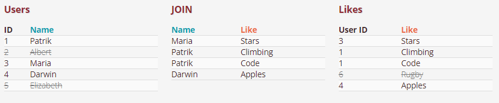
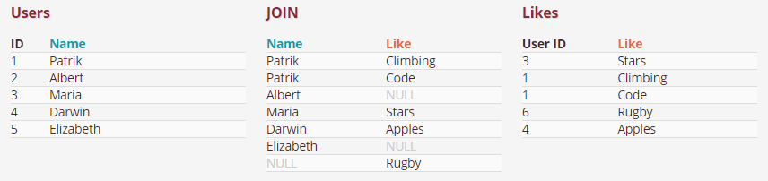

# RDBGuide
관계형 데이터베이스에 대한 공부

## 제 1 정규화
  * Atomic columns 
  * 한개의 컬럼에 1개의 값만 들어가야 한다.
  * 컬럼을 더 만들어 넣는다.

## 제 2 정규화
  * No partial dependencies
  * 부분 종속성이 없어야 한다.
  * 테이블의 특정 부분들이 집합이 되어 PK에 의존하면 안된다.
  * 집합을 따로 테이블을 만들어 넣는다.

## 제 3 정규화
  * No transitive dependencies
  * 이행 종속성이 없어야 한다.
  * 테이블의 특정 부분들이 내부 컬럼값에 의존하면 안된다.
  * 의존 부분들을 따로 테이블을 만들어 넣는다.

## Inner Join
  * 내부 조인은 조인되는 컬럼의 짝이 없을 경우 제외된다.   
  * 소개팅과도 같다. 짝이 없으면? 나가리... 나는 인싸 조인이라고 부른다.     
  *     
  * SELECT * FROM table_a JOIN table_b ON a.id = b.a_id;

## Outer Join
  * 외부 조인은 조인되는 컬럼의 짝이 없어도 모두 포함된다.
  * Join 되는 컬럼이 겹치지 않는다면 null 로 들어간다.
  * 
  * SELECT * FROM table_a LEFT OUTER JOIN table_b ON a.id = b.a_id   
    UNION   
    SELECT * FROM table_a RIGHT OUTER JOIN table_b ON a.id = b.a_id;