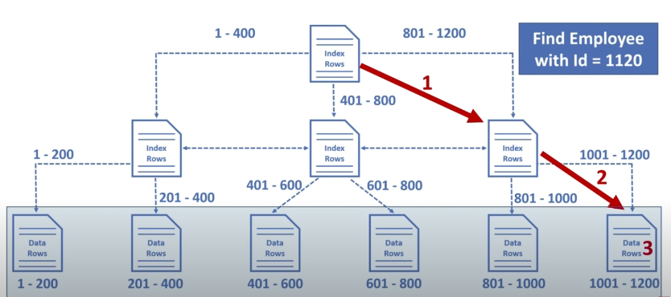

# RDBGuide
관계형 데이터베이스에 대한 공부

TODO : B+ tree 이어서 작성하기
## 정규화
  

  

  제 1 정규화
  

   

  * Atomic columns 
  * 한개의 컬럼에 1개의 값만 들어가야 한다.
  * 컬럼을 더 만들어 넣는다.
  드랍다운 내용
  

   

  

  

  제 2 정규화
  

   

  * No partial dependencies
  * 부분 종속성이 없어야 한다.
  * 테이블의 특정 부분들이 집합이 되어 PK에 의존하면 안된다.
  * 집합을 따로 테이블을 만들어 넣는다.
  

   

  

  

  제 3 정규화
  

   
  
  * No transitive dependencies
  * 이행 종속성이 없어야 한다.
  * 테이블의 특정 부분들이 내부 컬럼값에 의존하면 안된다.
  * 의존 부분들을 따로 테이블을 만들어 넣는다.
  

   

## Join
  

  

  Inner Join
  

   

  * 내부 조인은 조인되는 컬럼의 짝이 없을 경우 제외된다.
  * 소개팅과도 같다. 짝이 없으면? 나가리... 나는 인싸 조인이라고 부른다.
  * 
  * SELECT * FROM table_a JOIN table_b ON a.id = b.a_id;
  

   

  

  

  Outer Join
  

   
  
  * 외부 조인은 조인되는 컬럼의 짝이 없어도 모두 포함된다.
  * Join 되는 컬럼이 겹치지 않는다면 null 로 들어간다.   
       
  * SELECT * FROM table_a LEFT OUTER JOIN table_b ON a.id = b.a_id   
    UNION   
    SELECT * FROM table_a RIGHT OUTER JOIN table_b ON a.id = b.a_id;
  

   
    
## [Indexing](https://www.youtube.com/watch?v=HubezKbFL7E)
  

  

  Clustered index
  

   

  테이블이 생성될 때 pk 를 기준으로 나열된 Balanced+ Tree 가 생깁니다.   
  이 B+ Tree 를 사용하는 index 가 Clustered index 이라고 합니다.   

     

  여기에서 leaf node 들은 모두 data Rows 라고 나오는데 이는 Data 의 정보를 I/O 할 위치정보를 담고 있습니다.   

     

  다음은 WHERE id = 1120 가 Clustered index B+ tree 를 타는 과정입니다.   

  

     

  

  

  Non-clustered index
  

   
  
  PK 가 아닌 다른 컬럼에 인덱싱을 하신다면 이는 모두 Non-clustered index 에 해당됩니다.      
  이 인덱스의 동작 원리는 B+ tree 이며 해당 인덱스의 값을 바탕으로 정렬됩니다.   

     

  Row Locators 이라고 나온 값들은 실제 데이터의 PK 값을 저장하고 있습니다.   
  그래서 Non-clustered index 를 통과하고 그 이후에 Clustered index 를 통과하게 됩니다.   
  

   

  

  

  B+ Tree
  

   

  B+ Tree 는 leaf node 들이 doubly linked list 의 형태가 되어 있는 경우입니다.   
  

   